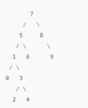

# Proje 3: Binary Search Tree

Verilen dizi: `[7, 5, 1, 8, 3, 6, 0, 9, 4, 2]`

### Binary-Search-Tree Aşamaları

1. **Root belirlenir:**  
   İlk eleman `7` root olarak seçilir.

2. **5 eklenir:**  
   `5`, `7`'den küçük olduğu için soluna eklenir.

3. **1 eklenir:**  
   `1`, `7`'den küçük ve `5`'ten de küçük olduğu için `5`'in soluna eklenir.

4. **8 eklenir:**  
   `8`, `7`'den büyük olduğu için sağına eklenir.

5. **3 eklenir:**  
   `3`, `7`'den küçük, `5`'ten küçük, ancak `1`'den büyük olduğu için `1`'in sağına eklenir.

6. **6 eklenir:**  
   `6`, `7`'den küçük, ancak `5`'ten büyük olduğu için `5`'in sağına eklenir.

7. **0 eklenir:**  
   `0`, `7`'den küçük, `5`'ten küçük ve `1`'den küçük olduğu için `1`'in soluna eklenir.

8. **9 eklenir:**  
   `9`, `7`'den büyük ve `8`'den büyük olduğu için `8`'in sağına eklenir.

9. **4 eklenir:**  
   `4`, `7`'den küçük, `5`'ten küçük, `1`'den büyük ve `3`'ten büyük olduğu için `3`'ün sağına eklenir.

10. **2 eklenir:**  
    `2`, `7`'den küçük, `5`'ten küçük, `1`'den büyük ve `3`'ten küçük olduğu için `3`'ün soluna eklenir.

### Ortaya Çıkan Binary Search Tree

